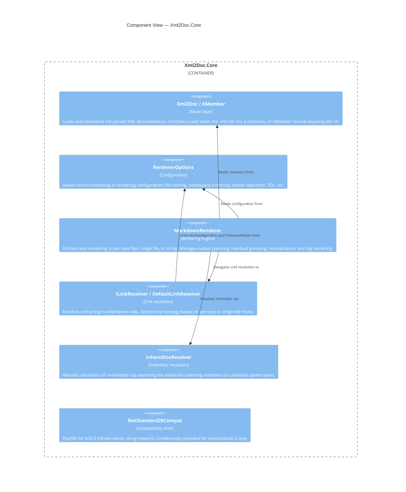

[LLAMARC42-METADATA]
Type: Architecture

Concepts: [
  "C4 Level 3",
  "component view",
  "MarkdownRenderer",
  "ILinkResolver",
  "InheritDocResolver",
  "RendererOptions",
  "Xml2DocModel"
]

Scope: Component

Confidence: Observed

Source: [
  "code"
]
[/LLAMARC42-METADATA]

# Component View

## C4 Level 3 — Internal Components of Xml2Doc.Core

This diagram shows the internal components of `Xml2Doc.Core` and their relationships.

## Components

### Xml2Doc / XMember (Model)

**File:** `Models/Xml2DocModel.cs`

Responsibilities:
- `Xml2Doc.Load(string xmlPath)` — reads the compiler-generated `.xml` file and builds a `Dictionary<string, XMember>` keyed by doc ID (e.g., `"T:Ns.Type"`, `"M:Ns.Type.Method(System.String)"`)
- `XMember` is a `sealed record` holding `Name`, `Element` (the raw `XElement`), `Kind` (e.g., `"T"`, `"M"`), and `Id` (the identifier after the colon)

### RendererOptions

**File:** `RendererOptions.cs`

Responsibilities:
- Encapsulates all rendering configuration as a `sealed record` with positional parameters and defaults
- Passed by value through the system; immutable
- Used by `MarkdownRenderer` and `DefaultLinkResolver`

For the full list of options (implemented vs declared-only), see [overview/scope.md](../overview/scope.md).

> **Note:** The `sealed record` modifier ensures value equality and immutability, which is important for fingerprinting in the MSBuild task. The developer has noted this may have been a missed implementation detail — it is currently implemented as a `sealed record`.

### MarkdownRenderer

**File:** `MarkdownRenderer.cs` (~1,261 lines)

Responsibilities:
- `RenderToDirectory(string outDir)` — emits one `.md` per type plus `index.md`; optionally emits namespace index pages
- `RenderToSingleFile(string outFile)` — emits one consolidated `.md`
- `RenderToString()` — renders to string (used in tests)
- `PlanOutputs(string outDir, string? singleFilePath)` — returns the list of files that would be written without writing them (used for dry-run and reporting)
- Overload grouping: method overloads share one heading; individual signatures are listed as bullets
- Paragraph-preserving XML → Markdown normalization: code blocks kept verbatim; soft wraps collapsed; stray whitespace before punctuation removed
- Depth-aware generic argument splitting for nested generics (e.g., `Dictionary<string, List<Dictionary<string, int>>>`)
- Token-aware aliasing: framework types (`System.String`) replaced by C# keywords (`string`) without corrupting identifiers like `StringComparer`
- Anchor computation: `IdToAnchor` (member anchors), `HeadingSlug` (heading slugs, algorithm-selectable)

### ILinkResolver / DefaultLinkResolver

**Files:** `Linking/ILinkResolver.cs`, `Linking/DefaultLinkResolver.cs`

Responsibilities:
- `ILinkResolver.Resolve(string cref, LinkContext context)` — converts a `cref` string to a `MarkdownLink` (href + label)
- `LinkContext` carries: `CurrentTypeId`, `SingleFile` flag, `BasePath`
- `DefaultLinkResolver` is constructed with four delegates from `MarkdownRenderer`:
  - `labelFromCref` — readable label from cref (applies aliases, trims namespaces)
  - `idToAnchor` — member id → anchor fragment
  - `typeFileName` — type id → `.md` filename
  - `headingSlug` — heading text → slug
- Link strategy:
  - Per-type mode: types → `TypeFile.md`; members → `TypeFile.md#member-anchor`
  - Single-file mode: types → `#heading-slug`; members → `#member-anchor`

`ILinkResolver` is internal. The developer has confirmed it is **stable** in its current form.

### InheritDocResolver

**File:** `InheritDocResolver.cs`

Responsibilities:
- Resolves `<inheritdoc>` tags by searching the parsed model for matching members
- **Case 1:** Explicit `cref` attribute → direct model lookup
- **Case 2:** Heuristic traversal — trims type ID segments to find candidate parent types in the same model
- Merges inherited content into the current member's `XElement` (fills empty nodes only; does not override author-provided content)

**Limitation:** This is a heuristic. It does not perform reflection against compiled binaries. Cross-assembly `<inheritdoc>` resolution is not supported.

### NetStandard20Compat (Compatibility Shim)

**Files:** `Compat/NetStandard20Compat.cs`, `IsExternalInit.cs`

Responsibilities:
- Provides polyfills for APIs unavailable in `netstandard2.0`
- Conditionally compiled (`#if NETSTANDARD2_0`)
- Allows the Core library to compile cleanly for all three TFMs without duplicating logic

> **Cross-reference:** [components/core.md](../components/core.md) · [container-view.md](container-view.md)
