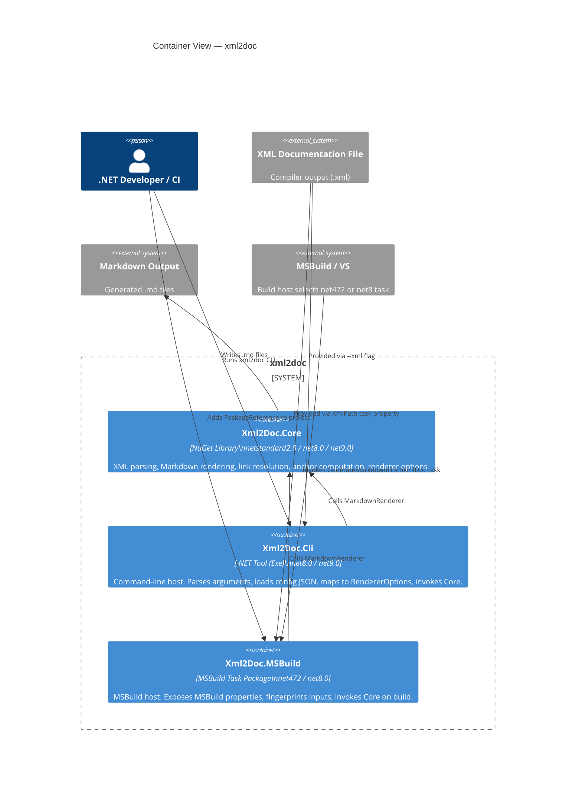

[LLAMARC42-METADATA]
Type: Architecture

Concepts: [
  "C4 Level 2",
  "container view",
  "Xml2Doc.Core",
  "Xml2Doc.Cli",
  "Xml2Doc.MSBuild",
  "deployable unit"
]

Scope: System

Confidence: Observed

Source: [
  "code",
  "docs"
]
[/LLAMARC42-METADATA]

# Container View

## C4 Level 2 — Deployable Units

This diagram shows the three deployable units of xml2doc and how they relate to each other and to external inputs/outputs.

## Containers

### Xml2Doc.Core

- **Type:** Class library (NuGet package)
- **Frameworks:** `netstandard2.0`, `net8.0`, `net9.0`
- **Role:** The rendering engine. Owns all XML parsing, Markdown generation, link resolution, anchor computation, and output planning.
- **Key public surface:** `MarkdownRenderer`, `RendererOptions`, `Xml2Doc` (model), `XMember`, `FileNameMode`, `AnchorAlgorithm`
- **Internal surface:** `ILinkResolver`, `DefaultLinkResolver`, `InheritDocResolver`, `LinkContext`, `MarkdownLink`

### Xml2Doc.Cli

- **Type:** Console application (dotnet tool)
- **Frameworks:** `net8.0`, `net9.0`
- **Role:** CLI host. Parses 30+ command-line flags, optionally merges a JSON config file, constructs `RendererOptions`, loads the XML model, and calls Core.
- **Command name:** `xml2doc`
- **Exit codes:** `0` = success, `1` = invalid args, `2` = unhandled error
- **Config precedence:** CLI args > JSON config file > RendererOptions defaults

### Xml2Doc.MSBuild

- **Type:** MSBuild task package (DevelopmentDependency)
- **Frameworks:** `net472`, `net8.0`
- **Role:** MSBuild host. Exposes properties (e.g., `Xml2Doc_Enabled`, `Xml2Doc_OutputDir`), computes fingerprints for incremental execution, and invokes Core via `GenerateMarkdownFromXmlDoc`.
- **Host selection:**
  - VS / MSBuild.exe → `net472` task → Core `netstandard2.0`
  - `dotnet build` → `net8.0` task → Core `net8.0`
- **Output properties:** `GeneratedFiles` (task item array), `ReportPathOut`

## Data Flows

| Flow | From | To | Format |
|------|------|----|--------|
| XML documentation | Compiler | Core (via CLI or MSBuild) | `.xml` (standard .NET doc format) |
| Renderer options | CLI args or MSBuild props | `RendererOptions` record | In-memory |
| Markdown output | Core | File system | `.md` files |
| JSON report | Core (via CLI/MSBuild) | File system | `xml2doc-report.json` |
| Fingerprint | MSBuild task | File system | `.fingerprint` file |

> **Cross-reference:** [component-view.md](component-view.md) · [components/core.md](../components/core.md)
