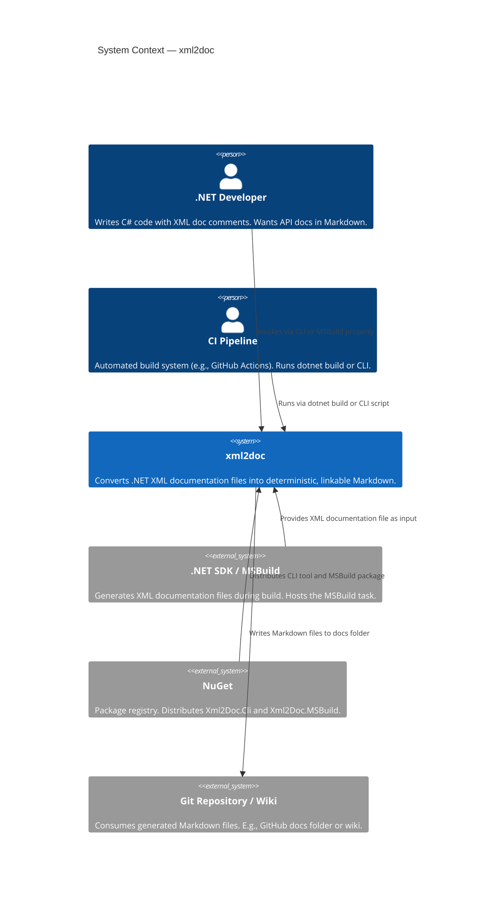

[LLAMARC42-METADATA]
Type: Architecture

Concepts: [
  "system context",
  "C4 Level 1",
  ".NET developer",
  "CI pipeline",
  "MSBuild"
]

Scope: System

Confidence: Mixed

Source: [
  "code",
  "docs"
]
[/LLAMARC42-METADATA]

# System Context

## C4 Level 1 — System Context Diagram

This diagram shows xml2doc as a system and its relationships with external actors and systems.

## External Actors

### .NET Developer

A developer using C# who has `<GenerateDocumentationFile>true</GenerateDocumentationFile>` in their project. They want to publish API documentation as Markdown alongside their source code or on a documentation site.

Interaction modes:
- Run `xml2doc --xml ...` from the command line
- Add `<PackageReference Include="Xml2Doc.MSBuild">` to a project
- Reference `Xml2Doc.Core` and invoke `MarkdownRenderer` directly

### CI Pipeline

An automated build system (e.g., GitHub Actions, Azure Pipelines) that runs `dotnet build` or invokes the CLI as part of a documentation publishing workflow.

### .NET SDK / MSBuild

The build system that compiles C# projects and generates the `.xml` documentation file. When `Xml2Doc.MSBuild` is installed as a `DevelopmentDependency`, MSBuild invokes the `GenerateMarkdownFromXmlDoc` task automatically after compilation.

### NuGet

The package registry where `Xml2Doc.Cli` (as a .NET tool) and `Xml2Doc.MSBuild` (as a development dependency) are published.

### Git Repository / Wiki

The destination for generated Markdown files. Typically a `docs/` folder inside the repository, consumed by GitHub's file browser, a static site generator, or a wiki system.

## What xml2doc Does NOT Interact With

| System | Reason Not In Scope |
|--------|-------------------|
| Static site generators (Jekyll, Hugo, Docusaurus) | xml2doc outputs files; SSGs consume them separately |
| Documentation hosting platforms | Not a hosting service |
| .NET reflection / runtime | Only compiler-emitted XML is parsed; no binary loading |
| External documentation APIs | `ExternalDocs` option is declared but not yet implemented |

> **Cross-reference:** [container-view.md](container-view.md) · [overview/scope.md](../overview/scope.md)
