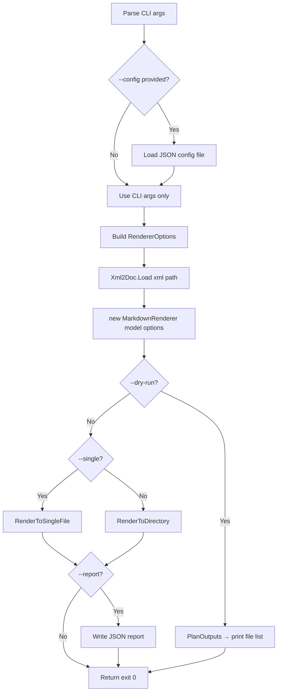

[LLAMARC42-METADATA]
Type: Component

Concepts: [
  "Xml2Doc.Cli",
  "CLI tool",
  "RendererOptions",
  "config file",
  "exit codes",
  "dry-run"
]

Scope: Component

Confidence: Observed

Source: [
  "code",
  "docs"
]
[/LLAMARC42-METADATA]

# Component: Xml2Doc.Cli

## Identity

| Property | Value |
|----------|-------|
| Assembly | `Xml2Doc.Cli` |
| Type | Console application (.NET tool) |
| Frameworks | `net8.0`, `net9.0` |
| Tool command | `xml2doc` |
| NuGet package | `Xml2Doc.Cli` |
| Version | 1.4.0 (current) |

## Role

`Xml2Doc.Cli` is a thin CLI host for `Xml2Doc.Core`. It is responsible for:

- Parsing command-line arguments
- Loading and merging an optional JSON config file
- Mapping inputs to `RendererOptions`
- Invoking `MarkdownRenderer` from Core
- Writing output files (or dry-running)
- Emitting a JSON report (optional)
- Returning a meaningful exit code

It contains **no rendering logic**. All rendering behavior lives in Core.

## Entry Point

**File:** `Xml2Doc/src/Xml2Doc.Cli/xml2doc.cs`

```csharp
internal static class Program
{
    public static int Main(string[] args)
}
```

## Exit Codes

| Code | Meaning |
|------|---------|
| `0` | Success (including dry-run) |
| `1` | Invalid arguments |
| `2` | Unhandled error |

## Command-Line Interface

### Required Arguments

| Flag | Description |
|------|-------------|
| `--xml <path>` | Input XML documentation file |
| `--out <dir\|file>` | Output directory (per-type) or file (single-file) |

### Rendering Options

| Flag | RendererOptions field |
|------|-----------------------|
| `--single` | Single-file output mode |
| `--file-names <verbatim\|clean>` | `FileNameMode` |
| `--rootns <ns>` | `RootNamespaceToTrim` |
| `--trim-rootns-filenames` | `TrimRootNamespaceInFileNames` |
| `--lang <id>` | `CodeBlockLanguage` |
| `--anchor-algorithm <default\|github\|kramdown\|gfm>` | `AnchorAlgorithm` |
| `--toc` | `EmitToc` |
| `--namespace-index` | `EmitNamespaceIndex` |
| `--basename-only` | `BasenameOnly` |
| `--parallel <N>` | `ParallelDegree` |
| `--template <file>` | `TemplatePath` *(declared, not yet implemented)* |
| `--front-matter <file>` | `FrontMatterPath` *(declared, not yet implemented)* |
| `--auto-link` | `AutoLink` *(declared, not yet implemented)* |
| `--alias-map <file>` | `AliasMapPath` *(declared, not yet implemented)* |
| `--external-docs <url\|file>` | `ExternalDocs` *(declared, not yet implemented)* |

### Operational Flags

| Flag | Description |
|------|-------------|
| `--dry-run` | Plan outputs without writing files; returns exit 0 |
| `--report <file>` | Write JSON report listing generated files |
| `--diff` | Reserved for future use |
| `--config <file>` | Load options from a JSON config file |
| `--help`, `-h` | Show help text |

## Configuration File

The CLI accepts a JSON config file via `--config`. The config file supports the same keys as the CLI flags. Example keys: `Xml`, `Out`, `Single`, `FileNames`, `RootNamespace`, `CodeLanguage`.

**Precedence (highest to lowest):**
1. Explicit CLI arguments
2. JSON config file values
3. `RendererOptions` defaults

> **Note on xml2xdoc.json:** The file `xml2xdoc.json` in the repository root is an older artifact using a legacy key naming scheme. It is accepted as a historical artifact and may be removed in a future cleanup. Current config key names should be preferred.

## Workflow



## Cross-TFM Behavior

The CLI produces **deterministically equivalent output** across `net8.0` and `net9.0`. This equivalence is enforced by a cross-TFM consistency test in CI that renders with both TFMs and asserts identical Markdown output (with EOL normalization).

> **Cross-reference:** [components/core.md](core.md) · [components/msbuild.md](msbuild.md) · [workflows/key-scenarios.md](../workflows/key-scenarios.md)
