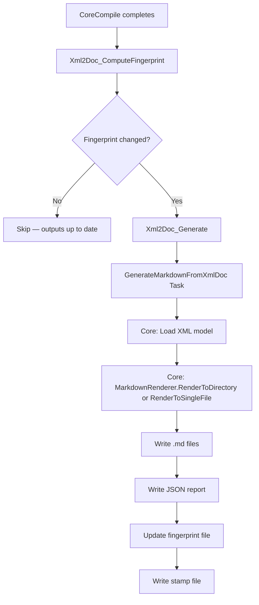

[LLAMARC42-METADATA]
Type: Component

Concepts: [
  "Xml2Doc.MSBuild",
  "MSBuild task",
  "incremental build",
  "fingerprinting",
  "GenerateMarkdownFromXmlDoc",
  "net472",
  "DevelopmentDependency"
]

Scope: Component

Confidence: Observed

Source: [
  "code",
  "docs"
]
[/LLAMARC42-METADATA]

# Component: Xml2Doc.MSBuild

## Identity

| Property | Value |
|----------|-------|
| Assembly | `Xml2Doc.MSBuild` |
| Type | MSBuild task package (DevelopmentDependency) |
| Frameworks | `net472`, `net8.0` |
| NuGet package | `Xml2Doc.MSBuild` |
| `DevelopmentDependency` | `true` (does not appear in transitive deps) |
| Version | 1.4.0 (current) |

## Role

`Xml2Doc.MSBuild` is a thin MSBuild host for `Xml2Doc.Core`. It is responsible for:

- Exposing MSBuild properties that map to `RendererOptions`
- Computing a fingerprint of inputs (XML hash + option set) for incremental execution
- Invoking `GenerateMarkdownFromXmlDoc` (the MSBuild `Task`) after compilation
- Reporting generated files as `[Output]` task items
- Writing a stamp file on success for reliable incremental behavior

It contains **no rendering logic**. All rendering behavior lives in Core.

## Framework Selection

The task uses a `UsingTask` with a condition to select the correct TFM at build time:

| Build Host | MSBuildRuntimeType | Task TFM | Core TFM |
|------------|-------------------|----------|----------|
| `dotnet build` | `Core` | `net8.0` | `net8.0` |
| Visual Studio / MSBuild.exe | (other) | `net472` | `netstandard2.0` |

> **Developer confirmation:** The net472 + net8 pairing was settled after working through issue #46, which found this to be the viable combination for broad MSBuild host support.

## MSBuild Task: GenerateMarkdownFromXmlDoc

**File:** `Xml2Doc/src/Xml2Doc.MSBuild/GenerateMarkdownFromXmlDoc.cs`

```csharp
public class GenerateMarkdownFromXmlDoc : Microsoft.Build.Utilities.Task
{
    [Required] public string XmlPath { get; set; }
    public string? OutputDirectory { get; set; }
    public bool SingleFile { get; set; }
    public string? OutputFile { get; set; }
    public string FileNameMode { get; set; } = "verbatim";
    public string? RootNamespaceToTrim { get; set; }
    public bool TrimRootNamespaceInFileNames { get; set; }
    public string CodeBlockLanguage { get; set; } = "csharp";
    public string? ReportPath { get; set; }
    public bool DryRun { get; set; }
    public bool Diff { get; set; }
    public bool EmitToc { get; set; }
    public bool EmitNamespaceIndex { get; set; }
    public bool BasenameOnly { get; set; }
    public string? AnchorAlgorithm { get; set; }

    [Output] public ITaskItem[] GeneratedFiles { get; private set; }
    [Output] public string? ReportPathOut { get; private set; }
}
```

## Build Targets

Two targets are defined in `Xml2Doc.MSBuild.targets`:

### `Xml2Doc_ComputeFingerprint`

- Runs **AfterTargets: `CoreCompile`**
- Computes a SHA-256 hash of the XML documentation file
- Combines the hash with a serialization of all effective `RendererOptions` values
- Writes the fingerprint to a `.fingerprint` file in the intermediate output directory
- If the fingerprint is unchanged from the previous run, the generation target is skipped

### `Xml2Doc_Generate`

- Runs **DependsOnTargets: `Xml2Doc_ComputeFingerprint`**
- Invokes `GenerateMarkdownFromXmlDoc` with all mapped properties
- Updates the fingerprint file on successful generation
- Writes a `.stamp` file for MSBuild's own incremental tracking

## Default MSBuild Properties

Defined in `Xml2Doc.MSBuild.props`:

| Property | Default |
|----------|---------|
| `Xml2Doc_Enabled` | `true` |
| `Xml2Doc_SingleFile` | `false` |
| `Xml2Doc_OutputDir` | `$(MSBuildProjectDirectory)\docs` |
| `Xml2Doc_FileNameMode` | `clean` |
| `Xml2Doc_CodeBlockLanguage` | `csharp` |
| `Xml2Doc_ReportPath` | `$(Xml2Doc_OutputDir)\xml2doc-report.json` |

Users can override any of these in their `.csproj` or `Directory.Build.props`.

## Incremental Build Flow



## Integration with GenerateDocumentationFile

The task reads the XML file path from the `XmlPath` property. This must be set to the output of `<GenerateDocumentationFile>true</GenerateDocumentationFile>`. The `Xml2Doc.MSBuild.targets` file wires this automatically when the package is installed.

## Sample Project Opt-In

The `Xml2Doc.Sample` test project sets `Xml2Doc_Enabled=false` as a default to avoid unwanted generation during test builds. Projects must explicitly enable it.

> **Cross-reference:** [components/core.md](core.md) · [workflows/runtime-flows.md](../workflows/runtime-flows.md)
