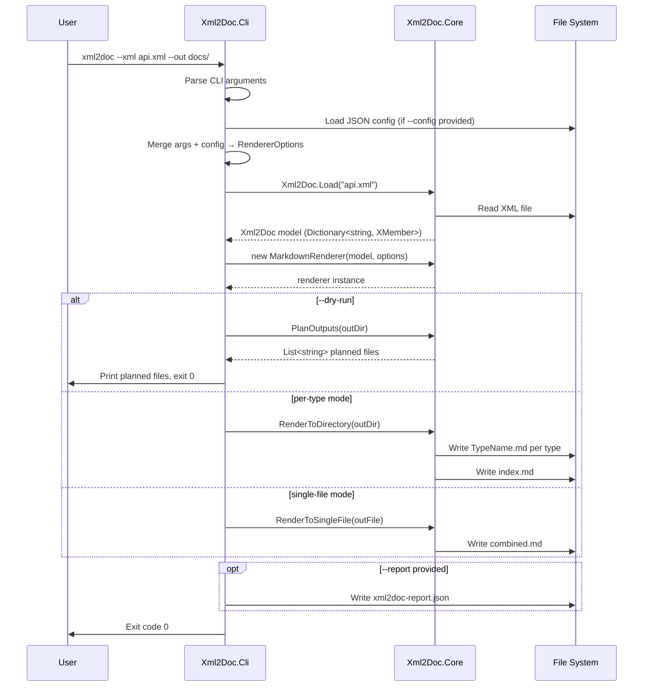
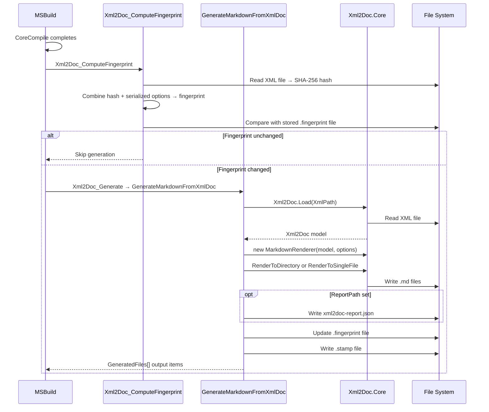
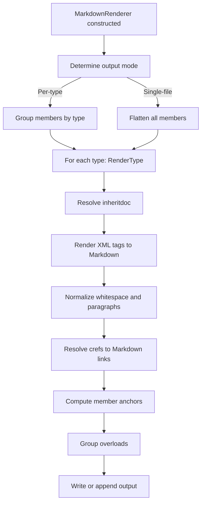

[LLAMARC42-METADATA]
Type: Workflow

Concepts: [
  "runtime flow",
  "XML loading",
  "Markdown rendering",
  "link resolution",
  "fingerprinting",
  "incremental build"
]

Scope: System

Confidence: Observed

Source: [
  "code",
  "docs"
]
[/LLAMARC42-METADATA]

# Runtime Flows

## Overview

This document describes the end-to-end execution flows for each entry point: CLI and MSBuild. Both flows share the Core rendering pipeline but differ in how inputs are collected and how outputs are managed.

---

## Flow 1: CLI Invocation

### Key Data Transformations

| Stage | Input | Output |
|-------|-------|--------|
| XML loading | `.xml` file (compiler output) | `Dictionary<string, XMember>` |
| Options resolution | CLI args + optional JSON | `RendererOptions` (immutable record) |
| Rendering | Model + options | `.md` files |
| cref resolution | `cref` string + `LinkContext` | `MarkdownLink` (href + label) |
| Anchor computation | Member ID string | Anchor fragment string |

---

## Flow 2: MSBuild Integration

---

## Core Rendering Pipeline (Shared)

Both CLI and MSBuild flows invoke the same Core rendering pipeline once `MarkdownRenderer` is constructed.

### cref Resolution Detail

When the renderer encounters a `<see cref="...">` or `<seealso cref="...">` tag:

1. `DefaultLinkResolver.Resolve(cref, context)` is called
2. The kind character (`T`, `M`, `P`, etc.) determines link strategy
3. In per-type mode:
   - Type (`T:`) → `TypeFile.md`
   - Member (`M:`/`P:`/etc.) → `TypeFile.md#member-anchor`
4. In single-file mode:
   - Type → `#heading-slug`
   - Member → `#member-anchor`
5. Label is derived from the cref with alias substitution and namespace trimming applied

### Anchor Computation Detail

Two anchor functions are used:

| Function | Input | Output | Used For |
|----------|-------|--------|----------|
| `IdToAnchor` | Member doc ID (no `X:` prefix) | `method-membername-param1-param2` | Explicit member anchors |
| `HeadingSlug` | Heading text string | Slug per `AnchorAlgorithm` setting | Type heading anchors (single-file) |

`IdToAnchor` applies:
- Token-aware alias substitution (`System.String` → `string`, but `StringComparer` unchanged)
- `{}` → `[]` (generic brace normalization)
- Lowercase

---

## InheritDoc Resolution

Before rendering any member, `InheritDocResolver` is consulted if `<inheritdoc>` is present:

1. If `cref` attribute is set on `<inheritdoc>`, the model is looked up directly by that key
2. Otherwise, the resolver trims type ID segments heuristically to find matching members in parent types within the same XML model
3. Resolved content is merged into the member's `XElement` (existing author content is never overwritten)

**Limitation:** Cross-assembly inheritance is not resolved. Only members present in the same XML file are candidates.

> **Cross-reference:** [workflows/key-scenarios.md](key-scenarios.md) · [components/core.md](../components/core.md)
